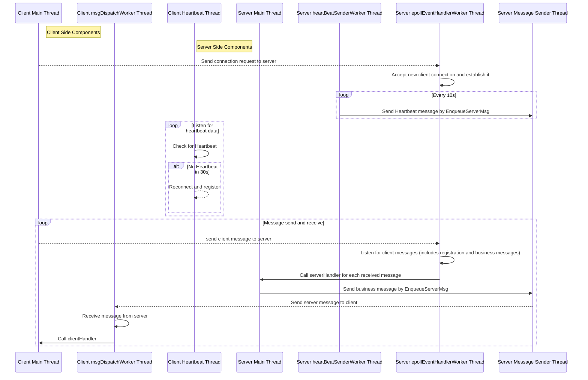

```mermaid
%%{init: {'theme':'default', 'themeVariables': {'fontSize': '30px'}}}%%
sequenceDiagram
%%   title Client-Server Communication Interface Timing Diagram
  
  Note right of ClientMain: Client Side Components
  participant ClientMain as Client Main Thread
  participant MsgWorker as Client msgDispatchWorker Thread
  participant HeartbeatWorker as Client Heartbeat Thread
  
  Note left of ServerMain: Server Side Components
  participant ServerMain as Server Main Thread
  participant HeartbeatSender as Server heartBeatSenderWorker Thread
  participant EpollHandler as Server epollEventHandlerWorker Thread
  participant MsgSender as Server Message Sender Thread

  ClientMain-->>EpollHandler: Send connection request to server
  EpollHandler->>EpollHandler: Accept new client connection and establish it

  loop Every 10s
    HeartbeatSender->>MsgSender: Send Heartbeat message by EnqueueServerMsg
  end
  
  loop Listen for heartbeat data
    HeartbeatWorker->>HeartbeatWorker: Check for Heartbeat
    alt No Heartbeat in 30s
      HeartbeatWorker-->>HeartbeatWorker: Reconnect and register
    end
  end
  
  loop Message send and receive
    ClientMain-->>EpollHandler: send client message to server
    EpollHandler->>EpollHandler: Listen for client messages (includes registration and business messages)
    EpollHandler->>ServerMain: Call serverHandler for each received message
    ServerMain->>MsgSender: Send business message by EnqueueServerMsg
    MsgSender-->>MsgWorker: Send server message to client
    MsgWorker->>MsgWorker: Receive message from server
    MsgWorker->>ClientMain: Call clientHandler
  end
```